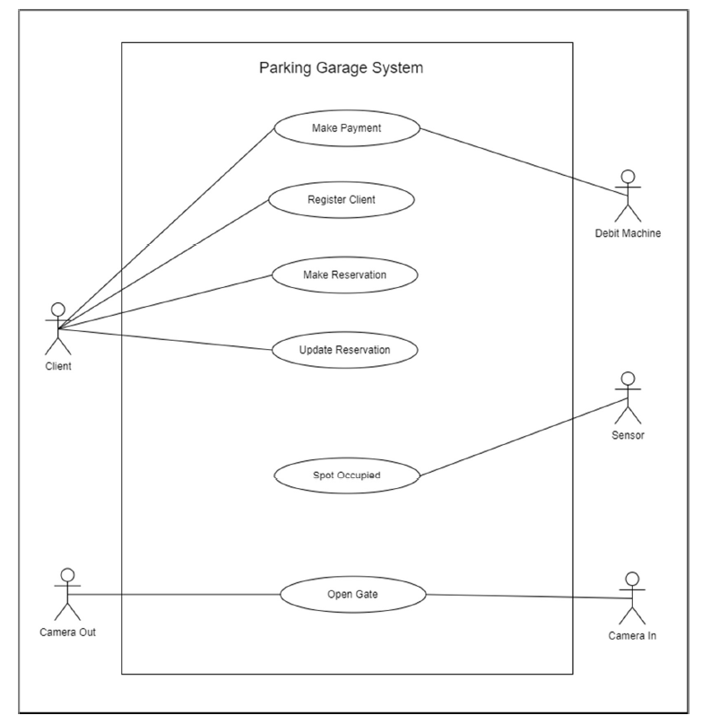
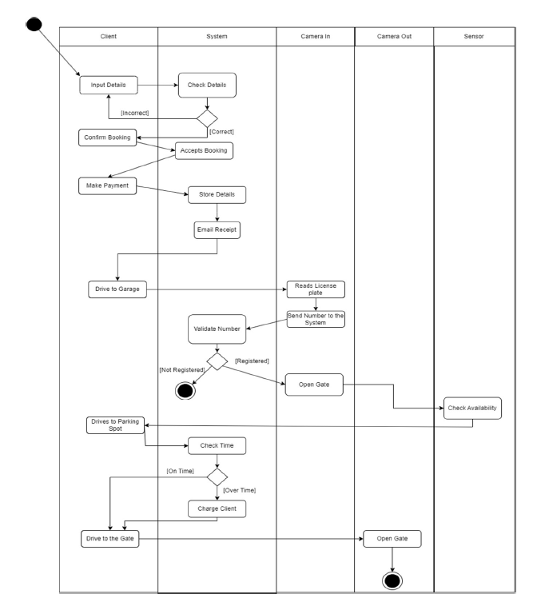
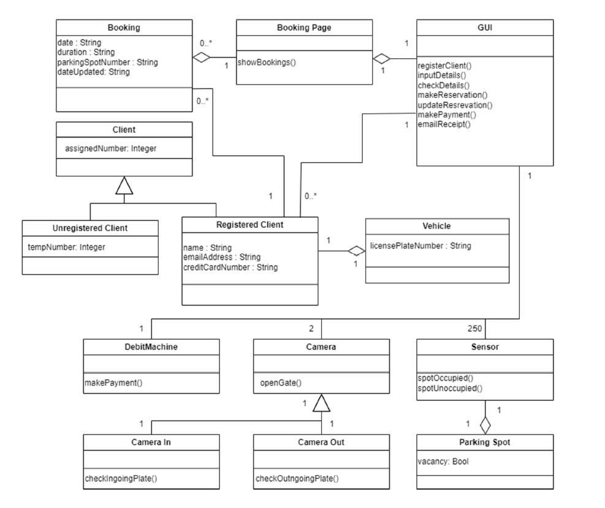
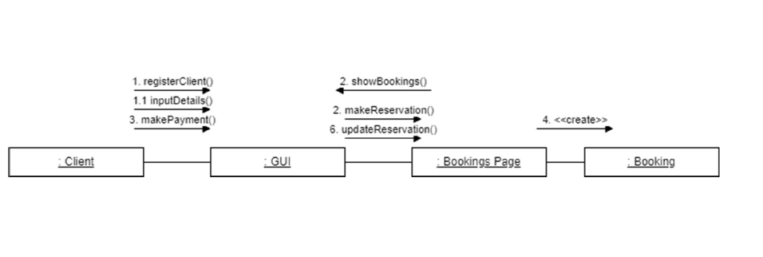
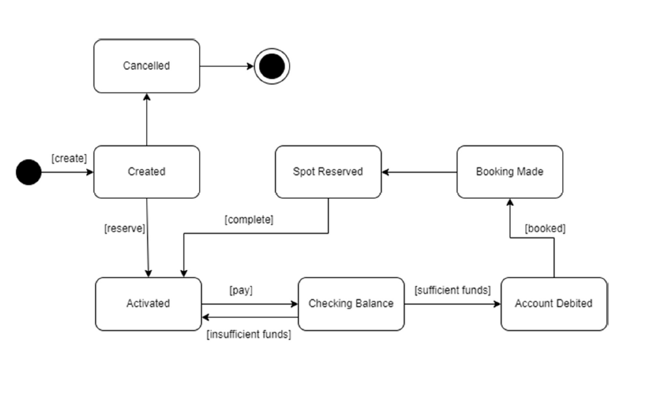

# smart-parking-system-design
UML-based design for a smart parking reservation system using Agile Scrum methodology.

# 🅿️ Smart Parking System – Software Engineering Design

This project presents a theoretical design for a smart parking reservation and access control system. It was developed as part of a software engineering course and focuses on modeling, process flow, and methodology selection.

---

## 🧑‍🤝‍🧑 Actors

- Client
- Camera (In/Out)
- Debit Machine
- Sensor

---

## ✅ Use Cases

- Register Client  
- Make Reservation  
- Make Payment  
- Update Reservation  
- Spot Occupied  
- Open Gate

---

## 🔁 Use Case Scenarios

**Primary Flow:**  
- Client registers on the website  
- System verifies and confirms booking  
- Payment is made online  
- Client arrives, license plate is verified, gate opens  

**Alternative Flows:**  
- Incorrect registration details trigger form reset  
- Overstaying requires payment at debit machine before gate opens  

---

## 🧩 Diagrams

### Use Case Diagram

### Activity Diagram

### Class Diagram

### Communication Diagram

### State Machine Diagram

---

## 🛠️ Methodology: Agile – Scrum Framework

The Scrum Framework was chosen to deliver this system to **Eduvos** due to its:

- Flexibility for changing requirements  
- Frequent feedback loops with the client  
- Time-boxed sprints for visible deliverables  
- Better risk and scope management  
- Efficient team collaboration  

> Full rationale included in [report](report/full-documentation.pdf) (optional)

---

## 📚 Skills Demonstrated

- UML modeling
- Scenario development
- Object-oriented analysis
- Agile methodology application
- Communication diagrams and state transitions

---

## Notes

This project is **design-focused** and does not include implementation code. It showcases understanding of software architecture, modeling, and project planning principles.
